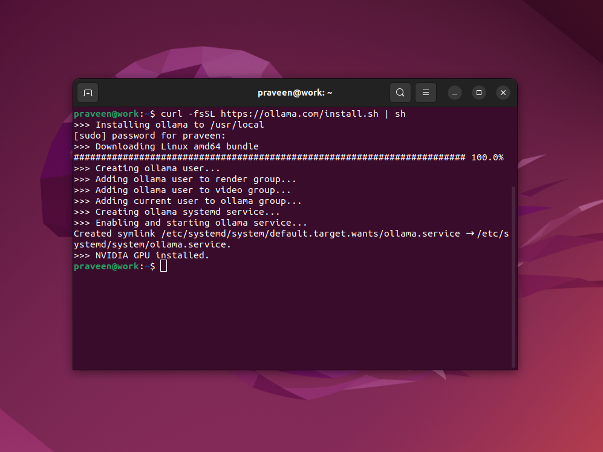

# OLLAMA


## Installing Ollama on Ubuntu

```
curl -fsSL https://ollama.com/install.sh | sh
```



## GPU - NVIDIA

### NVIDIA GeForce MX350


# Why the Sky is Blue

```
ollama run llama3.2
```

Asking why the sky is blue is a common question. I asked it from Ollama.


# Ollama Commands

```
ollama run llama3.2
````

```
ollama list
ollama ps
ollama show llama3.2
```


# Uncensored Dolphin

